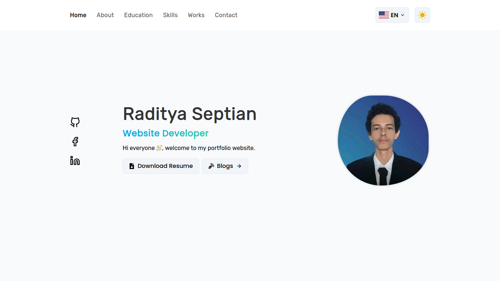

<h1 align="center">Personal Portfolio Website</h1>

<div align="center">
  <a href="https://www.radityaseptian.my.id/">
    
  </a>

  <p align="center">
    Personal portfolio website for introduce your self
    <br />
    <a href="https://www.radityaseptian.my.id/"><strong>View Demo »</strong></a>
    <br />
</div>

### Built With

This website using tech stack:

- React JS
- Tailwind CSS

## Getting Started.

### Prerequisites

tools needed before starting.

- Node js
- Npm

### Installation

1. Clone the repo
   ```sh
   git clone https://github.com/radityaseptian/portofolio.v2.git
   ```
2. ```sh
   cd portofolio.v2
   ```
3. Install NPM packages
   ```sh
   npm install
   ```

## Usage

1. Run command `npm run dev`

2. Open your browser and open `http://localhost:5173`

3. Change `/src/components`

## Contributing

1. Fork the Project
2. Create your Feature Branch (`git checkout -b your_branch`)
3. Commit your Changes (`git commit -m 'Add some AmazingFeature'`)
4. Push to the Branch (`git push origin your_branch`)
5. Open a Pull Request

## Contact

Raditya Septian - email@radityaseptian1551@gmail.com

Project Link: [https://github.com/radityaseptian/portofolio.v2](https://github.com/radityaseptian/portofolio.v2)
